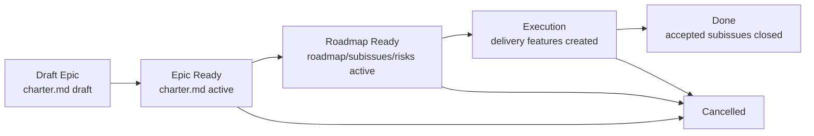

# Epic Flow

An epic is a governed initiative larger than one delivery feature. It defines shared intent, boundaries, roadmap, decisions, risks, and subissue registry, but does not replace a feature package and does not contain a code-level execution plan.

FPF basis:

Terminology is defined in [`../dna/glossary.md`](../dna/glossary.md).

- **Bounded Contexts**: an epic divides a large initiative into meaningful contexts and delivery slices so business, operations, finance, UI/API, and implementation are not mixed.
- **Strict Distinction**: epic, feature, PRD, use case, ADR, and implementation plan have different owners and must not replace each other.
- **Evidence Graph**: epic decisions must link to sources, stakeholder answers, specs, ADR, or code facts.
- **Q-Bundle**: epic quality cannot be reduced to one score; it is checked through the separate properties below.

## Package Rules

1. All documents for one epic live in `memory_bank/epics/EP-XXX/`.
2. `README.md` is the routing layer and annotated index.
3. `charter.md` is the canonical owner of intent: problem, outcome, scope/non-scope, stakeholder channels, source/evidence boundaries.
4. `roadmap.md` is the execution order owner: waves, gates, dependencies, stop rules, and handoff protocol.
5. `decision-log.md` is the local decision ledger for decisions that affect the epic but do not require global ADR.
6. `subissues.md` is the registry of candidate and accepted delivery subissues, each mapped to roadmap waves and source `SLICE-*`/`UC-*`.
7. `risks.md` is the epic-level risk register for financial, operational, scope, and delivery risks.
8. `design.md`, `specs/**`, `diagrams/**`, `source-docs/**` are optional knowledge artifacts. They are allowed only when indexed from the epic package and governed by the knowledge artifact rules below.
9. `implementation-plan.md` is not created inside an epic. Code-level execution belongs to a separate `memory_bank/features/FT-<issue>/` package.
10. For canonical epic docs, use templates from `memory_bank/flows/templates/epic/`.

## Layer Model

| Layer | Primary docs | Owns | Must NOT define |
| --- | --- | --- | --- |
| Intent | `charter.md` | business/problem frame, scope, non-scope, source evidence, stakeholder channels | file paths, code steps, final implementation sequence |
| Roadmap | `roadmap.md`, `subissues.md` | waves, dependencies, issue candidates, handoff gates | final code plan, exact migrations, test commands |
| Governance | `decision-log.md`, `risks.md` | local decisions, risk controls, stop rules | global architecture policy unless promoted to ADR |
| Knowledge | `design.md`, `specs/**`, `diagrams/**`, linked `UC-*` | bounded contexts, source-backed specs, contracts, scenario coverage | delivery issue ownership or code execution |
| Execution | future `features/FT-<issue>/` | one approved delivery change with tests and rollout | reopening epic scope without updating epic owners |

## Knowledge Artifact Rules

Knowledge artifacts exist only to normalize evidence in an initiative made of multiple features. They do not replace `charter.md`, `roadmap.md`, `decision-log.md`, `subissues.md`, or `risks.md`.

1. Any markdown knowledge artifact inside `memory_bank/epics/EP-XXX/` must be linked from the package `README.md` or from a linked epic owner document so reachability remains explicit.
2. Markdown knowledge artifacts use YAML frontmatter with `doc_kind: epic`, `doc_function: reference`, `status`, and `derived_from`.
3. `derived_from` points to the epic owner whose fact is normalized (`charter.md`, `roadmap.md`, `decision-log.md`, `subissues.md`, `risks.md`) and to external/source references when relevant.
4. Knowledge artifacts may define local reference IDs for source excerpts, context maps, diagrams, or normalized specs, but must not define roadmap waves, subissue status, risk controls, accepted global architecture decisions, or code execution steps.
5. `source-docs/**` is used for source-backed references or links. If source material is copied into the repo as Markdown, it follows these frontmatter and reachability rules.

## Lifecycle

## Transition Gates

### Bootstrap Epic

- [ ] `README.md` created
- [ ] `charter.md` created
- [ ] `implementation-plan.md` absent
- [ ] if source docs are already known, they are separated from derived specs

### Draft -> Epic Ready

- [ ] `charter.md` has `status: active`
- [ ] scope/non-scope explicit
- [ ] source/evidence boundaries explicit
- [ ] stakeholder channels and decision process recorded
- [ ] known out-of-scope topics recorded to prevent reopening

### Epic Ready -> Roadmap Ready

- [ ] `roadmap.md` active and names execution waves
- [ ] `subissues.md` active and maps candidates to waves/slices
- [ ] `risks.md` active and names controls/owners
- [ ] `decision-log.md` active when non-trivial decisions exist
- [ ] first delivery feature can be created without inventing epic-level facts

### Roadmap Ready -> Execution

- [ ] one approved subissue or delivery slice selected
- [ ] created/selected Issue Tracker issue is linked to epic package
- [ ] new `memory_bank/features/FT-<issue>/` package exists
- [ ] the new feature package imports only relevant epic refs (`charter.md`, `roadmap.md`, `subissues.md`, `risks.md`, and `decision-log.md` if used), not the whole epic scope
- [ ] feature `brief.md` records its `Plan required: yes/no` decision from `feature-flow.md`; originating from an epic does not override the feature-level Plan triggers

## Q-Bundle

Epic quality is a Q-Bundle, not one scalar.

| Quality | What must be visible | Review question |
| --- | --- | --- |
| Traceability | Source docs, decisions, requirements, UC and subissues linked by stable IDs | Can a reviewer trace each planned feature back to evidence? |
| Decomposability | Bounded contexts and slices are separated | Can we create one delivery issue without dragging the whole epic? |
| Roadmap clarity | Waves, dependencies, gates and stop rules are explicit | Does the team know what should happen first and why? |
| Decision provenance | `decision-log.md` links facts, FPF reasoning and consequences | Is a decision backed by evidence rather than preference? |
| Scope control | Non-scope and stop rules are explicit | Can we prevent accidental expansion during delivery? |
| Risk governance | `risks.md` lists risks, controls and owners | Are high-impact financial/operator risks visible before code? |
| Execution handoff | `subissues.md` and roadmap define feature-package inputs | Can a slice owner start without re-reading the whole epic? |
| Evidence readiness | Open facts and confidence gaps are recorded | Do we know where facts are missing and who can close them? |
| Change control | Epic changes update owner docs before downstream plans | Will scope/design drift be caught before implementation? |

## Stable Identifiers

| Prefix | Meaning | Owner |
| --- | --- | --- |
| `EP-SI-*` | Epic subissue candidate or accepted subissue | `subissues.md` |
| `W*` | Roadmap wave | `roadmap.md` |
| `HG-*` | Handoff gate before feature execution | `roadmap.md` |
| `ERISK-*` | Epic-level risk | `risks.md` |
| `DL-*` | Local decision log entry | `decision-log.md` |
| `SLICE-*` | Candidate delivery slice | epic decomposition spec |

## Boundary Rules

1. Epic may define roadmap waves, but not file-level execution steps.
2. Epic may define subissue candidates, but does not make them implementation-ready until a delivery issue and feature package exist.
3. Epic may close local decisions with FPF and evidence. If a decision changes global project architecture, create ADR.
4. A feature package created from an epic must link to relevant `EP-*` docs and preserve stable IDs instead of copying the whole scope. `brief.md` imports problem/scope refs; `design.md` or ADR imports epic-local decisions when they affect solution space.
5. If a feature discovers a new epic-level fact, update the epic owner document first, then update the feature.
