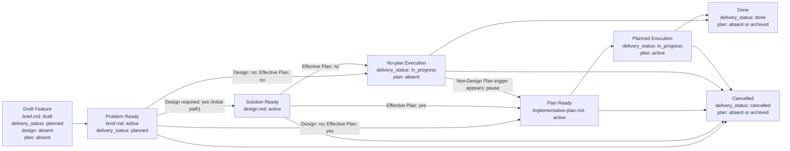

# Feature Flow

This document defines the order in which feature artifacts appear. The agent must move a feature package through stages and must not create downstream artifacts before its upstream owner is mature.

## Version Boundary

Memory bank v2 is the current structure for new feature packages.

- New feature packages start with `brief.md`. They add a routing `README.md` only when a design, plan, or support document appears, add `design.md` only for real solution ownership, and add `implementation-plan.md` only for real execution sequencing or handoff.
- V2 packages without a Plan Requirement Decision remain valid through the compatibility rule below; they do not need a documentation-only rewrite.
- Existing packages that already use `feature.md` remain valid legacy v1 packages until they are explicitly migrated.
- Do not rewrite historical `features/FT-*` packages only to satisfy v2.
- Do not remove an existing package `README.md` only to adopt the single-file budget; the brief-only shape is the default for newly authored compact packages, not a cleanup requirement.
- Migrate a package only when current work materially changes its scope, selected solution, verification contract, or execution plan.

### Package Format Resolution

Resolve `PACKAGE_FORMAT` before applying v2 Design / Plan rules. Ignore archived owner files when selecting the current format:

1. one `active` or `draft` `brief.md` and no current `feature.md` means `PACKAGE_FORMAT: v2`;
2. one `active` or `draft` `feature.md` and no current `brief.md` means `PACKAGE_FORMAT: legacy_v1` and follows only [Legacy v1 Compatibility](#legacy-v1-compatibility);
3. both current owner types, neither current owner type, or an existing owner file with missing or invalid status requires a human gate; do not select a format automatically.

`legacy_v1` packages do not have a Plan Requirement Decision and do not use v2 compatibility rules. During an explicit migration, prepare the v2 brief, then archive `feature.md` and activate `brief.md` as one reviewed ownership switch. A temporary mixed-owner state does not select a package format automatically.

### V2 Missing Plan Decision Compatibility

Every newly authored `brief.md` must record an exact `Plan required: yes/no` decision. When any v2 brief has no Plan Requirement Decision, read its current topology without trying to determine the file's age or reconstruct Git history:

1. if `implementation-plan.md` exists, maintain the package as plan-required until an explicit decision says otherwise;
2. if `implementation-plan.md` is absent, maintain the package on the no-plan path until an explicit decision says otherwise;
3. when current work intentionally adds or removes `implementation-plan.md`, or materially changes the package's execution lifecycle, add the explicit Plan Requirement Decision before making that change;
4. if the field is present, accept only exact `yes` or `no`; an empty, unparseable, or other value requires a human gate.

This compatibility rule trusts the current package topology. Reviewers do not need a Git baseline, a special revision input, or proof that a brief predates this field.

## Documentation Scale

Task routing and feature-package elevation triggers are owned by [workflows.md](workflows.md#feature-package-elevation). If it classifies the task as a Small Feature, do not create `memory_bank/features/FT-*` by default. Issue / PR notes, tests, and targeted updates to existing owner documents are enough unless that upstream workflow elevates the task.

When a feature package is needed for a small change, use the governed compact form:

- bootstrap only `brief.md` and register it directly from `memory_bank/features/README.md`;
- keep `brief.md` to the required minimum IDs unless extra problem-space facts are needed;
- when `Design required: no`, allow a short `Design Notes` section that identifies the established pattern and feature-local application without introducing new architecture, contracts, or invariants;
- when `Plan required: no`, keep only the bounded `Execution Controls` allowed by [When `implementation-plan.md` Is Required](#when-implementation-planmd-is-required);
- create `design.md` and `implementation-plan.md` only when their corresponding gates require them; create support docs only when their documented support trigger applies;
- create package-level `README.md` when a design, plan, or support document appears, then route every package document that remains in the directory, including archived historical artifacts;
- in every instantiated template, delete unused placeholder sections and tables instead of preserving empty structure;
- prefer links to the issue, PR, tests, or existing owners over restating the same facts in several memory-bank documents.

The goal of compact form is not to skip governance. It is to preserve the smallest artifact set that still protects scope, design ownership, verification, and handoff.

## Package Rules

1. All documents for one feature live in `memory_bank/features/FT-XXX/`.
2. **Feature = vertical slice.** One feature is one unit of user value that passes through all affected system layers (UI, API, storage, infra). Horizontal slicing ("all endpoints", "the whole UI") is allowed only for purely infrastructure or refactoring tasks and must be explicitly justified through `NS-*`.
3. `brief.md` is the canonical owner of problem space: problem, outcome, scope, non-scope, assumptions, constraints, unresolved blocking decisions, and the canonical verification contract for the delivery unit.
4. A compact `brief.md` may contain bounded `Design Notes` that point to an established pattern or accepted ADR and describe only its feature-local application. `design.md` becomes the separate canonical owner of solution space only when the feature requires new or materially changed architecture, contract/protocol/data-flow/trust semantics, alternatives, invariants, failure-mode design, rollout/backout design, C4 artifacts, or new feature-local ADR-backed decisions.
5. A single-file package is routed directly from `memory_bank/features/README.md`. Package-level `README.md` is optional while `brief.md` is the only content document and required as soon as a design, plan, or support document appears. Once present, it keeps every package document indexed, including archived historical artifacts.
6. The lifecycle owner for `delivery_status` is only canonical `brief.md`. `design.md`, feature-level `README.md`, and `implementation-plan.md` do not duplicate this field.
7. `design.md` appears only after `Problem Ready` and only if `brief.md` records `Design required: yes`.
8. New `brief.md` documents record a **Plan Requirement Decision**. The decision selects the lifecycle path: `implementation-plan.md` is created only for `yes`, after upstream owners are ready; for `no`, execution follows the no-plan lifecycle and the plan remains absent. Any v2 package without the field uses [V2 Missing Plan Decision Compatibility](#v2-missing-plan-decision-compatibility).
9. For canonical `brief.md`, conditional canonical `design.md`, conditional feature-level `README.md`, and conditional `implementation-plan.md`, use wrapper templates from `memory_bank/flows/templates/feature/`: the template file itself has `doc_function: template`, while the frontmatter/body of the instantiated document live inside the embedded template contract.
10. The meaning of stable identifiers (`REQ-*`, `SOL-*`, `SD-*`, `STEP-*`, etc.) is defined in the "Stable Identifiers" section below.
11. Acceptance scenarios (`SC-*`) cover the vertical slice end to end: from input event to observable result through all affected layers. Testing a separate layer in isolation is allowed as an implementation detail of execution, but does not replace end-to-end acceptance.
12. **Task tracker links.** When creating a feature package, record the source task / ticket link in `brief.md` and add a link to `brief.md` in that task. After downstream documents appear, add links to the existing `design.md` and `implementation-plan.md` in the task as well.
13. If the feature is part of a larger initiative, `brief.md` may depend on a PRD from `memory_bank/prd/`, but the PRD does not replace the feature package itself.
14. If the feature creates a new durable project scenario or materially changes an existing one, the relevant `UC-*` in `memory_bank/use-cases/` must be created or updated before closure.
15. Optional feature-support docs (`runtime-surfaces.md`, `ui-reference/README.md`, and `use-cases/README.md`) are allowed as grounding / review / traceability aids. They do not become canonical owners of problem space, solution space, acceptance inventory, or execution sequencing. Creating any support doc expands the package and therefore also requires the package `README.md` route.
16. If the feature depends on an upstream initiative document, `brief.md` imports only the relevant upstream references, not the entire upstream scope.
17. If the work is larger than one delivery feature and requires a roadmap, risk register, or several delivery units, do not expand the feature package. Choose the appropriate upstream flow from `memory_bank/flows/` and treat every approved delivery unit as a separate feature package.

## `brief.md` Template

New feature packages use one canonical brief template: `memory_bank/flows/templates/feature/brief.md`.

`brief.md` scales by content:

- a compact feature fills the minimum set: `REQ-*`, `NS-*`, Design Requirement Decision, Plan Requirement Decision, `SC-*`, `CHK-*`, `EVID-*`;
- a governed compact feature may add short `Design Notes` for reuse of an established pattern and bounded `Execution Controls`, including `AG-*`, without creating another owner;
- complex problem-space content adds `MET-*`, `ASM-*`, `CON-*`, `DEC-*`, `NEG-*`, several acceptance scenarios, richer traceability, and an evidence contract;
- new or materially changed solution semantics do not expand `brief.md`; selected architecture, contracts/protocols/data flows, C4, invariants, failure modes, and rollout/backout use sibling `design.md`.

If problem space is complex, expand the same `brief.md` by content instead of choosing another template. If problem space is not complex, do not keep optional placeholder sections only because they exist in the template.

## When `design.md` Is Required

`brief.md` must record a **Design Requirement Decision** before transition to `Problem Ready`: `Design required: yes/no` and a short reason. Only exact `yes` and `no` values may select a downstream path; a missing, unparseable, or non-enum value requires a human gate. This is not selected design; it is a gate decision for choosing the downstream path.

`design.md` is required if at least one condition is true:

1. the feature introduces or materially changes a shared API/event/schema/file/CLI/env contract, background-job or queue/storage topology, authentication/trust model, financial semantics, provider protocol/data flow/failure semantics, or operational rollout mechanics;
2. the solution requires alternatives/trade-off reasoning, a new ADR or feature-specific interpretation of an existing ADR, C4/data-flow diagram, migration strategy, rollout/backout design, or explicit failure-mode design;
3. downstream execution notes or `implementation-plan.md` would otherwise have to make architecture decisions, contracts, or invariants before describing steps;
4. the feature has a design pack made of several artifacts; `design.md` must index them and name the owner of each design fact.

Adding another consumer, endpoint configuration, adapter, or policy instance through an established pattern is not a Design trigger by itself, even when an external integration is involved, provided the protocol, data flow, trust model, shared contract, failure semantics, and rollout mechanics remain unchanged. Merely applying an existing accepted ADR is also not a trigger. In these cases `brief.md` records `Design required: no`, cites the established owner, and may use a short `Design Notes` section for the feature-local application. Those notes must not introduce alternatives, new architecture, new contracts/invariants, or rollout design.

When `design.md` is required for a small but material contract, integration, rollout, or trust-model change, it may still be compact. Keep only the C4 applicability decision, selected solution facts, contracts / invariants / failure modes that affect implementation or review, and traceability to `REQ-*`. Omit alternatives, trade-offs, rollout/backout, ADR tables, or diagrams when they do not carry real feature-local design information.

## When `implementation-plan.md` Is Required

A newly authored `brief.md` must record a **Plan Requirement Decision** before transition to `Problem Ready`: `Plan required: yes/no` and a short reason. Only exact `yes` and `no` values are valid explicit decisions; a present decision with a missing, unparseable, or non-enum value requires a human gate. Any v2 brief without the field follows V2 Missing Plan Decision Compatibility. The decision selects the execution path without putting implementation sequencing into `brief.md`.

`implementation-plan.md` is required if at least one condition is true:

1. execution needs cross-session handoff, parallel workstreams, explicit sequencing, or intermediate checkpoints;
2. execution includes destructive or irreversible production/data/infra mutation, or another risky or costly external action that needs ordered approval, stop, rollback, or fallback choreography;
3. unresolved execution dependencies or several manual gates cannot be handled safely by one bounded brief control plus ordinary issue / PR notes;
4. a human explicitly asks for an implementation plan.

A single bounded, safely reversible setup, access, or smoke check does not require `implementation-plan.md` by itself. Record its owner and approval/evidence through `AG-*`, `CHK-*`, and `EVID-*` in `brief.md`; sequencing, rollback, several approvals, or handoff use the plan triggers above.

The no-plan path is allowed only when all of the following are true:

1. none of the plan-required triggers above applies;
2. required solution facts are already owned by `design.md` / ADR, or `Design required: no` is recorded;
3. `brief.md` plus the source issue / task and eventual PR can carry the bounded controls, implementation summary, commands, results, and evidence links.

For the no-plan path, `brief.md` records `Plan required: no` and the reason, `implementation-plan.md` remains absent, and any bounded gate stays in `brief.md`; transient commands and results remain in the issue / PR.

If a new Design or Plan trigger appears during active work, pause downstream work and update the owning decision before continuing:

- a new Design trigger sets `Design required: yes`, moves existing `design.md` and `implementation-plan.md` to `status: draft`, and requires `Solution Ready` to pass again; after that, re-pass `Plan Ready` only when Plan Requirement is `yes`;
- a new non-Design Plan trigger sets `Plan required: yes`, creates or moves `implementation-plan.md` to `status: draft`, and requires `Plan Ready` to pass before execution resumes;
- if an affected document is already draft, incorporate the change there without introducing another lifecycle state;
- retain existing evidence and `delivery_status` while work is paused;
- after `Done` or `Cancelled`, do not mutate the closed package; handle the trigger as follow-up work with fresh Design / Plan decisions.

## C4 Analysis Requirements

If `design.md` is required, it must record a **C4 applicability decision** before `Solution Ready`: which minimum C4 level is needed, or why C4 is not needed. The goal is not to draw diagrams for their own sake, but to explicitly check architecture boundaries before execution begins.

### When C4 Is Not Needed

C4 can be omitted if the change simultaneously:

1. stays inside one already existing component/module;
2. does not change API/event/schema/file format/env/queue/storage/integration/security boundary;
3. does not introduce a new runtime/deployable/container or a new background execution path;
4. does not redistribute responsibility between bounded contexts, engines, services, or external systems.

In this case `design.md` records `C4-00: not required` and a short reason.

### Minimum C4 Level

| Trigger in design analysis | Required C4 level | What to show |
| --- | --- | --- |
| User interaction, external system, external API, regulated financial, compliance-sensitive, or provider integration, or trust boundary with the system changes | C1 System Context | System, actors/external systems, direction of interaction, trust/data boundary |
| Runtime/deployable/container boundary changes: frontend/backend, app/worker, queues, cache/storage, Docker/Kubernetes/CI | C2 Container | Containers/runtime nodes, data stores, queues, protocols, ownership of data flow |
| Internal decomposition inside one container changes: application services/readers/writers, orchestration, state machine, domain module split, shared component boundary, regulated or security-critical collaboration | C3 Component | Components/modules inside the container, responsibilities, call/event/data direction |
| Class-level design must be explained as an architecture decision: framework extension, reusable library contract, non-trivial algorithm object graph, concurrency/locking primitive | C4 Code | Only critical classes/interfaces and relationships; do not use for ordinary CRUD/service changes |

If a trigger falls into several rows, choose the deepest required level and preserve traceability to higher-level boundaries.

### C4 Artifact Rules

1. A C4 artifact can be Mermaid, PlantUML, Structurizr DSL, image, or Markdown table, if it unambiguously conveys the selected C4 level.
2. A C4 artifact is part of the design pack and is indexed from `design.md`.
3. A C4 artifact must not contain execution steps, file-level TODOs, or test commands.
4. If a C4 level is required, `Solution Ready` is unreachable without the artifact or a link to an existing canonical C4/design artifact that covers the affected boundary.

## Optional Feature Support Docs

Support docs are created only when they remove real ambiguity or make review substantially more precise. They are `doc_kind: feature-support` and `doc_function: reference` / `index`, unless another function is explicitly justified.

| Support doc | When to create | What it records | What it does not own |
| --- | --- | --- | --- |
| `runtime-surfaces.md` | The feature touches several runtime entrypoints, concrete surfaces, semantic mappings, fallback/error paths, or context variants | current surface inventory, semantic mapping, adjacent out-of-scope surfaces, target mapping reference, context matrix, resolution / decision table, observability notes | requirements, selected design, acceptance criteria, implementation sequence |
| `ui-reference/README.md` | The feature changes interface, authoring flow, navigation, screen states, or preview/editor UX | generic interface reference: screen map, interaction states, component expectations, copy/state semantics, mockup links and UI traceability | project-specific UI framework rules, product requirements, selected architecture, implementation steps |
| `ui-reference/mockups/*.md` or another linkable artifact | Any interface change requires at least a low-fidelity mockup; default format is Markdown, but images, design-tool links, or other artifacts are allowed if they are versionable/linkable | screen sketch, state examples, interaction notes | canonical acceptance inventory or final visual design system |
| `use-cases/README.md` | There are many scenarios, distinct happy/edge/error journeys, several user roles, or a review-friendly `FUC -> REQ -> CHK` mapping is needed | derived user-facing scenarios, edge/error cases, candidate test cases, traceability back to canonical refs | canonical `SC-*`, `NEG-*`, `CHK-*`, `EVID-*` |

Automated review reports are transient execution artifacts, not feature-support documents, and are not routed from the feature package. The prompt that creates a report owns its storage and handling rules.

## Migration Strategy

- New feature packages start with directly registered `brief.md`, then follow the conditional design and plan-required/no-plan path selected there. Add package `README.md` only when a design, plan, or support document appears.
- When migrating the old package layout, first assign canonical owners: move problem-space content into `brief.md`, and required solution-space content into `design.md`.
- After migration, the package must not retain duplicate active owners for problem space or solution space.
- Migration can happen gradually, package by package.

## Legacy v1 Compatibility

Legacy v1 packages are existing packages with canonical `feature.md` plus optional `implementation-plan.md`.

Rules:

1. Existing `feature.md` packages remain current legacy v1 owners only while canonical `feature.md` has `status: active` or `status: draft`. An archived `feature.md` is historical evidence, does not select a current package format, and cannot make an archived-only directory a valid current package.
2. New packages must not use v1 templates unless explicitly created as a compatibility follow-up for an existing v1 package.
3. `short.md` and `large.md` remain available only as legacy reference templates.
4. A v1 package can be edited in place for small factual corrections, evidence updates, or closure notes.
5. A v1 package should be migrated to v2 before substantial new scope, selected solution changes, or plan rewrites.
6. During migration, `feature.md` can remain archived as the historical source, but active ownership moves to `brief.md` and optional `design.md`.

## Lifecycle

Lifecycle routing is fail-closed. Only exact `Design required: yes/no` and `Plan required: yes/no` values, or the current topology of a v2 package without the Plan field under V2 Missing Plan Decision Compatibility, select the arrows below. A missing or invalid Design decision, or an invalid present Plan decision, remains a human gate and must never default to the `no` / No-plan Execution branch.

## Transition Gates

Every gate is a set of verifiable predicates. A transition is allowed if and only if all predicates are true.

### Bootstrap Feature Package

- [ ] `brief.md` is created from the `templates/feature/brief.md` template
- [ ] `memory_bank/features/README.md` links directly to `brief.md`
- [ ] package-level `README.md` is not required while `brief.md` is the only content document: when omitted the registry links directly to the brief; if retained for compatibility it routes the brief; when a design, plan, or support document appears it becomes required and routes the package
- [ ] `design.md` is absent
- [ ] `implementation-plan.md` is absent

### Draft Feature -> Problem Ready

- [ ] `brief.md` -> `status: active`
- [ ] the `What` section contains at least one `REQ-*` and at least one `NS-*`
- [ ] the `Verify` section contains at least one `SC-*`
- [ ] every `REQ-*` traces to at least one `SC-*` and its `CHK-*` / `EVID-*` through explicit inline refs or one compact traceability table
- [ ] the `Verify` section contains at least one `CHK-*` and at least one `EVID-*`
- [ ] if the deliverable cannot be accepted without negative/edge coverage, at least one `NEG-*` exists
- [ ] `brief.md` contains Design Requirement Decision: `Design required: yes/no` and the reason
- [ ] the Plan Requirement is known: a newly authored `brief.md` contains `Plan required: yes/no` and the reason; any v2 brief without the field follows V2 Missing Plan Decision Compatibility
- [ ] apart from bounded established-pattern `Design Notes`, `brief.md` does not contain new accepted solution decisions, `How`, to-be C4 architecture model, `Change Surface`, solution-level `Flow`, `CTR-*`, `FM-*`, `RB-*`, or rollout/backout prose

### Problem Ready -> Solution Ready

- [ ] `brief.md` records `Design required: yes`
- [ ] `design.md` is created from the `templates/feature/design.md` template
- [ ] `design.md` -> `status: active`
- [ ] `design.md` contains at least one `SOL-*`
- [ ] `design.md` references at least one canonical `REQ-*` from sibling `brief.md`
- [ ] `design.md` records a C4 applicability decision; if a C4 level is required, a C4 artifact or link to a canonical C4/design artifact is present in the design pack
- [ ] package-level `README.md` routes `brief.md`, `design.md`, and every other document that remains in the package, including archived historical artifacts; `memory_bank/features/README.md` points to that package README
- [ ] selected design is stable enough that downstream execution sequencing no longer competes with it for ownership
- [ ] accepted feature-local decisions are moved into `SD-*`, and architectural / reusable / cross-feature decisions are recorded in accepted ADRs
- [ ] if the solution depends on an ADR, the corresponding ADR has `decision_status: accepted`
- [ ] on the first pass before planning, `implementation-plan.md` is absent; on a late-Design re-entry, an existing plan has `status: draft` and remains draft until it is updated to reference the accepted solution refs and `Plan Ready` is passed again

### Active Work -> Update Decisions -> Re-pass Required Gates

- [ ] evaluate closure first: after `Done` or `Cancelled`, create follow-up work instead of mutating the closed package
- [ ] pause downstream work when a new Design or Plan trigger appears
- [ ] for a Design trigger, set `Design required: yes`, create or move `design.md` to `status: draft`, move any existing plan to `status: draft`, and re-pass `Solution Ready`
- [ ] for a non-Design Plan trigger, set `Plan required: yes`, create or move `implementation-plan.md` to `status: draft` after upstream owners are ready, and re-pass `Plan Ready`
- [ ] after a Design update, re-pass `Plan Ready` only when Plan Requirement is `yes`; otherwise keep the plan absent and resume through No-plan Execution
- [ ] existing evidence remains linked and `delivery_status` retains its current value while work is paused

### Upstream Ready -> No-Plan Execution

- [ ] Plan Requirement is `no`, or a v2 package without the field has no `implementation-plan.md` under V2 Missing Plan Decision Compatibility
- [ ] none of the triggers from [When `implementation-plan.md` Is Required](#when-implementation-planmd-is-required) applies
- [ ] if `brief.md` records `Design required: yes`, sibling `design.md` has `status: active`
- [ ] `implementation-plan.md` is absent
- [ ] the source issue / task is linked as the lightweight execution carrier; the issue or eventual PR will record the implementation summary, check commands, results, and evidence links
- [ ] canonical `CHK-*` and `EVID-*` in `brief.md` identify the required automated coverage and local / CI verification
- [ ] any bounded no-plan gate follows the exception in [When `implementation-plan.md` Is Required](#when-implementation-planmd-is-required) and is recorded in `brief.md` through `AG-*`, `CHK-*`, and `EVID-*`
- [ ] `brief.md` -> `delivery_status: in_progress`

### No-Plan Execution -> Plan Ready (Non-Design Trigger)

- [ ] execution is paused when the first non-Design plan-required trigger appears
- [ ] `brief.md` changes to `Plan required: yes` and records the trigger
- [ ] required problem / solution owners are updated first; if the trigger changes selected design or another solution fact, re-pass `Solution Ready` first
- [ ] every predicate in `Upstream Ready -> Plan Ready` is satisfied before implementation resumes
- [ ] already collected evidence remains linked; `delivery_status` stays `in_progress` while execution is paused

### Upstream Ready -> Plan Ready

- [ ] Plan Requirement is `yes`, or a v2 package without the field already has `implementation-plan.md` under V2 Missing Plan Decision Compatibility
- [ ] the agent performed grounding: reviewed current system state (relevant paths, existing patterns, dependencies) and recorded the result in the discovery context section of `implementation-plan.md`
- [ ] if `brief.md` records `Design required: yes`, sibling `design.md` has `status: active`
- [ ] if `brief.md` records `Design required: no`, `implementation-plan.md` does not make architecture decisions, contracts, or invariants
- [ ] `implementation-plan.md` is created or updated according to the `templates/feature/implementation-plan.md` contract
- [ ] package-level `README.md` routes `brief.md`, required `implementation-plan.md`, conditional `design.md`, and every other document that remains in the package, including archived historical artifacts; `memory_bank/features/README.md` points to that package README
- [ ] `implementation-plan.md` -> `status: active`
- [ ] `implementation-plan.md` contains at least one `PRE-*`, at least one `STEP-*`, at least one `CHK-*`, and at least one `EVID-*`
- [ ] discovery context in `implementation-plan.md` contains relevant paths, local reference patterns, test surfaces, execution environment, and any unresolved questions as `OQ-*`; if there are no unresolved questions, it says so explicitly
- [ ] steps and workstreams in `implementation-plan.md` reference canonical IDs from `brief.md` and, if a design layer exists, solution refs from `design.md` / ADR

### Plan Ready -> Planned Execution

- [ ] `brief.md` -> `delivery_status: in_progress`
- [ ] if `design.md` exists, it has `status: active`
- [ ] `implementation-plan.md` -> `status: active`
- [ ] `implementation-plan.md` records the test strategy: automated coverage surfaces and required local/CI suites
- [ ] every manual-only gap has a reason, manual procedure, and `AG-*` with approval ref

### No-Plan Or Planned Execution -> Done

- [ ] all `CHK-*` from `brief.md` have a pass/fail result in evidence
- [ ] all `EVID-*` from `brief.md` are filled with concrete carriers (file path, CI run, screenshot)
- [ ] delivered behavior does not contradict accepted `SOL-*` / `SD-*` / ADR refs if a design layer exists
- [ ] automated tests for the change surface are added or updated
- [ ] required test suites are green locally and in CI
- [ ] every manual-only gap is explicitly approved by a human (approval ref in `AG-*` from `brief.md` or a required plan)
- [ ] the separate simplify review defined by `../engineering/testing-policy.md` is complete and its verdict is recorded
- [ ] if the feature adds a new stable flow or materially changes an existing project-level scenario, the relevant `UC-*` is created or updated and registered in `memory_bank/use-cases/README.md`
- [ ] `brief.md` -> `delivery_status: done`
- [ ] if the effective Plan Requirement is `yes`, `implementation-plan.md` -> `status: archived`
- [ ] if the effective Plan Requirement is `no`, `implementation-plan.md` remains absent and the issue / PR records the implementation summary plus concrete local / CI evidence carriers

### -> Cancelled (from any stage after Draft Feature)

- [ ] `brief.md` -> `delivery_status: cancelled`
- [ ] `implementation-plan.md` is absent or `status: archived`

## Boundary Rules

1. `brief.md` must contain the `What` and `Verify` sections.
2. `brief.md` owns problem space, the canonical verification contract, requirement decisions, and—only on the governed compact path—bounded design notes and execution controls.
3. Compact `Design Notes` may identify an established pattern and its feature-local application, but must not define new architecture, protocols/contracts, invariants, C4 models, alternatives, failure semantics, or rollout/backout. Compact `Execution Controls` may hold the bounded gate allowed by the no-plan exception above, but must not become a package-owned implementation sequence.
4. `DEC-*` in `brief.md` means only unresolved blocking decisions. Once a decision is accepted, it moves into `design.md` as `SD-*` or into ADR.
5. `design.md`, if needed, owns only solution space: selected design, C4 applicability/artifacts, accepted feature-local decisions, solution structure, internal flow, concrete contracts, invariants, solution-level failure modes, local rollout/backout semantics, and links to accepted ADRs.
6. `delivery_status` remains only on `brief.md`; `design.md` and `implementation-plan.md` do not duplicate lifecycle state for the delivery unit.
7. `design.md` must not redefine business requirements, scope, acceptance criteria, canonical checks, evidence contract, detailed current-system inventory, or execution sequencing.
8. Feature-support docs must not redefine canonical facts. They may provide surface inventory, UI reference, mockups, derived use cases, and review mappings only as support context.
9. If a feature creates a new ADR dependency or needs feature-specific interpretation of an ADR, the canonical owner of that dependency is `design.md`; a `proposed` ADR is not finalized design. A compact `brief.md` may cite an existing accepted ADR as the owner of an unchanged established pattern without creating `design.md` only to repeat that decision.
10. If a feature depends on a canonical use case, `brief.md` links to the corresponding file in `memory_bank/use-cases/`. The use case remains the owner of trigger/preconditions/main flow/postconditions at the project level, while `brief.md` records only the slice-specific problem and verification.
11. `implementation-plan.md`, when required, remains a derived execution document: it references canonical IDs from `brief.md` and, if present, solution refs from `design.md` / ADR, records discovery context and test strategy for execution, and does not redefine scope, selected design, C4 architecture model, blockers, acceptance criteria, or evidence contract. A bounded no-plan approval stays in `brief.md` and is not duplicated into a synthetic plan.
12. If scope, assumptions, constraints, acceptance criteria, or evidence contract change, update `brief.md` first. If selected design, to-be C4 architecture model, local accepted decisions, contracts, failure modes, or rollout/backout semantics change, update `design.md` or ADR first. Only then update a required downstream plan or the lightweight issue / PR execution notes.
13. If a support doc reveals a conflict with a canonical owner, the conflict cannot be resolved inside the support doc: update `brief.md`, `design.md`, ADR, or a required `implementation-plan.md` according to ownership.
14. If a numeric target threshold applies only to one delivery unit, the canonical owner is the corresponding `brief.md`. Such a KPI can be elevated into a project-level document only after it becomes a shared upstream fact for several features.
15. A required `implementation-plan.md` starts with discovery context: relevant paths, local reference patterns, unresolved questions, test surfaces, and execution environment must be recorded before sequencing changes.
16. Risky actions and approval gates follow [When `implementation-plan.md` Is Required](#when-implementation-planmd-is-required): coordinated or sequenced controls belong in the plan, while only the documented bounded exception may remain in `brief.md`.
17. If a feature executes part of an upstream initiative, `brief.md` must link only relevant upstream artifacts and imported IDs, not copy the whole upstream scope. If upstream solution decisions are used, `design.md` or ADR links to their canonical owner.
18. Upstream roadmap, cross-feature risks, and delivery-unit registries belong to upstream owner documents, not to the feature package.
19. On the no-plan path, the issue / PR owns only transient implementation notes, commands, results, and evidence links. It does not replace canonical problem / verify facts or bounded compact controls/notes in `brief.md`, nor expanded solution facts in `design.md` / ADR.
20. During active work, a new Design trigger or material selected-design change sets `Design required: yes`, moves existing design and plan artifacts to `status: draft`, and requires the applicable Solution / Plan gates to pass again. A new non-Design Plan trigger sets `Plan required: yes`, moves an existing plan to `status: draft`, and requires `Plan Ready` to pass again. Triggers found after closure become follow-up work.
21. For a v2 brief without a Plan Requirement Decision, current plan presence is the compatibility behavior. Current work adds an explicit decision before intentionally changing that topology or execution lifecycle.

## Testing Lifecycle Integration

Canonical coverage, manual-only verification, and simplify-review rules live in [Testing Policy](../engineering/testing-policy.md). Feature flow only maps ownership and lifecycle:

1. `brief.md` owns the delivery unit's `SC-*`, feature-specific `NEG-*`, `CHK-*`, and `EVID-*` inventory required by `Problem Ready`.
2. `design.md`, when required, records solution contracts and failure modes but does not own test strategy. A required `implementation-plan.md` owns execution strategy and coordinated manual controls; on the no-plan path, the issue / PR records commands, results, and evidence carriers.
3. `Done` requires the automated coverage, manual approvals, and separate simplify review defined by `../engineering/testing-policy.md`; this flow does not redefine those rules.

## Stable Identifiers

### Feature IDs

| Prefix | Meaning | Used in |
| --- | --- | --- |
| `MET-*` | outcome metrics | `brief.md` |
| `REQ-*` | scope and required capabilities | `brief.md` |
| `NS-*` | non-scope | `brief.md` |
| `ASM-*` | assumptions and working premises | `brief.md` |
| `CON-*` | problem-space constraints | `brief.md` |
| `DEC-*` | unresolved blocking decisions | `brief.md` |
| `EC-*` | exit criteria | `brief.md` |
| `SC-*` | acceptance scenarios | `brief.md` |
| `NEG-*` | negative / edge test cases | `brief.md` |
| `CHK-*` | checks | `brief.md`, `implementation-plan.md` |
| `EVID-*` | evidence artifacts | `brief.md`, `implementation-plan.md` |
| `AG-*` | human approval for a bounded setup/verification gate or planned risky action | `brief.md`, `implementation-plan.md` |
| `RJ-*` | rejection rules | `brief.md`, `implementation-plan.md` |

### Solution IDs

| Prefix | Meaning | Used in |
| --- | --- | --- |
| `SOL-*` | solution elements / selected design blocks | `design.md` |
| `ALT-*` | considered alternatives | `design.md` |
| `TRD-*` | trade-offs | `design.md` |
| `C4-*` | C4 applicability decision, model levels, elements, or relationships | `design.md` |
| `SD-*` | accepted feature-local solution decisions | `design.md` |
| `INV-*` | solution invariants | `design.md` |
| `CTR-*` | concrete solution contracts | `design.md` |
| `FM-*` | solution-level failure modes | `design.md` |
| `RB-*` | rollout / backout stages | `design.md` |

### Plan IDs

| Prefix | Meaning | Used in |
| --- | --- | --- |
| `PRE-*` | preconditions | `implementation-plan.md` |
| `OQ-*` | unresolved questions / ambiguities | `implementation-plan.md` |
| `WS-*` | workstreams | `implementation-plan.md` |
| `STEP-*` | atomic steps | `implementation-plan.md` |
| `PAR-*` | parallelizable blocks | `implementation-plan.md` |
| `CP-*` | checkpoints | `implementation-plan.md` |
| `ER-*` | execution risks | `implementation-plan.md` |
| `STOP-*` | stop conditions / fallback | `implementation-plan.md` |

### Support IDs

| Prefix | Meaning | Used in |
| --- | --- | --- |
| `SURF-*` | runtime surfaces / entrypoints / concrete render or processing surfaces | `runtime-surfaces.md` |
| `MAP-*` | semantic mapping rows or mapping rules | `runtime-surfaces.md` |
| `UI-*` | interface screens, states, controls, or interaction elements | `ui-reference/README.md` |
| `FUC-*` | derived feature-local use cases | `use-cases/README.md` |
| `TC-*` | derived test case candidates | `use-cases/README.md`, support docs |

### Required Minimum

1. Any canonical `brief.md` uses at least `REQ-*`, `NS-*`, `SC-*`, `CHK-*`, `EVID-*`.
2. Any `brief.md` with `status: active` defines at least one explicit test case through `SC-*`.
3. `brief.md` may use only the minimum problem-space set for a small feature or the extended feature ID set as needed; separate problem-space templates are not used.
4. Any required `design.md` uses at least one `SOL-*`, one `C4-*` decision, and links them to at least one `REQ-*` from sibling `brief.md`.
5. Any `design.md` records selection rationale for C4 applicability; selected C4 views use `C4-*` and link to `SOL-*`, `SD-*`, `CTR-*`, `INV-*`, `FM-*`, or ADR refs.
6. Any `design.md` with accepted feature-local decisions uses `SD-*`; `ALT-*`, `TRD-*`, `CTR-*`, `INV-*`, `FM-*`, and `RB-*` are used only when the corresponding solution semantics are actually needed.
7. Any optional support doc uses only local support IDs and traceability to canonical refs; it does not introduce new canonical `REQ-*`, `SC-*`, `CHK-*`, or `EVID-*`.
8. Any `implementation-plan.md` uses at least `PRE-*`, `STEP-*`, `CHK-*`, `EVID-*`; when ambiguity or coordinated/risky human approval gates exist, `OQ-*` and `AG-*` are used. A no-plan `brief.md` uses `AG-*` only for the bounded exception defined above and ties it to canonical `CHK-*` / `EVID-*`.

### Traceability Contract

1. Scope in `brief.md` is recorded through `REQ-*`, non-scope through `NS-*`.
2. Verify in `brief.md` links every `REQ-*` to `SC-*`, `CHK-*`, and `EVID-*` through inline refs or one compact traceability table. Add feature-specific `NEG-*`, a separate test matrix, or a richer evidence contract only when they add coverage or review value.
3. `design.md`, if present, links `REQ-*` from `brief.md` to `SOL-*`, `ALT-*`, `TRD-*`, `C4-*`, `SD-*`, `CTR-*`, `INV-*`, `FM-*`, `RB-*`, and accepted ADR refs.
4. A required `implementation-plan.md` references canonical IDs from `brief.md` and, if present, solution refs from `design.md` / ADR in the `Implements`, `Verifies`, and `Evidence IDs` columns.
5. If sequencing is blocked by unknowns, set `Plan required: yes` and record them as `OQ-*` instead of hiding them in prose.
6. Record `AG-*` in `brief.md` or `implementation-plan.md` according to the Plan Requirement rules above; always tie it to the applicable `CHK-*` / `EVID-*`.
7. If a Design trigger or material design / to-be C4 architecture change appears during active work, set Design Requirement to `yes`, retain Plan Requirement unless a separate Plan trigger applies, move existing design / plan artifacts to `draft`, and re-pass the applicable gates before resuming.
8. If a non-Design plan-required trigger appears during active work, set Plan Requirement to `yes`, create or move the plan to `draft`, and re-pass `Plan Ready` before resuming.
9. On the no-plan path, the issue / PR links the implemented `REQ-*`, the executed `CHK-*`, and the concrete carriers for `EVID-*` without introducing plan-only IDs.
